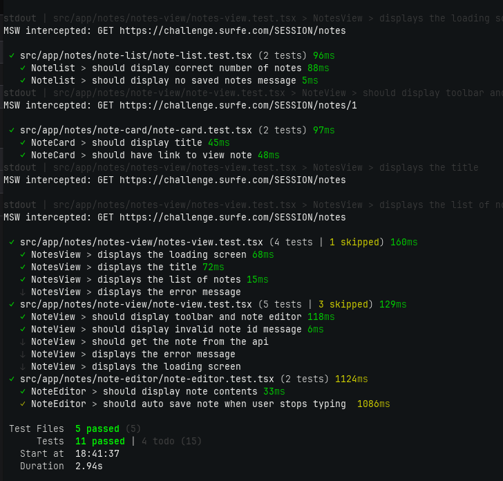

# Note Editor React App

## Install and run the app

To run the project, you need to install the required packages in your terminal by running the following command:

```
npm install
```

Before running the app you will need to add a `.env` file in the root of the application. All api calls use this API_PREFIX

```
// .env
VITE_API_PREFIX=https://challenge.surfe.com

```

To start the project, you can use the following command:

```npm run dev
npm run dev
```

This will start the development server and you can view the project in your browser at `http://localhost:5173`.

To run the tests, you can use the following command:

```npm run test
npm run test
```



# Features in the app

- [x] User can view list of notes
- [x] User can view selected note
- [x] User can edit and save a note
- [ ] User can mention other users in the note

## Notes and Decisions made

I have made small commits so you can see my thought process. In a team setting they may use feature branches but I choose to keep it simple for this task.

The tests currently hardcode the api prefix. I tried to use the prefix in the tests but I encountered some challenges so I skipped this for now to save time.

I created NoteApi which uses vanilla fetch. Typically I would use React Query.

I have added tests to show how I work with them. The tests are not exhaustive and more could be done. I have left `test.todo` statements.

I have used vanilla css and I have put more focus on logic and tests over styling. Things are responsive.

There a few things which could be improved but I am trying to save time now.
